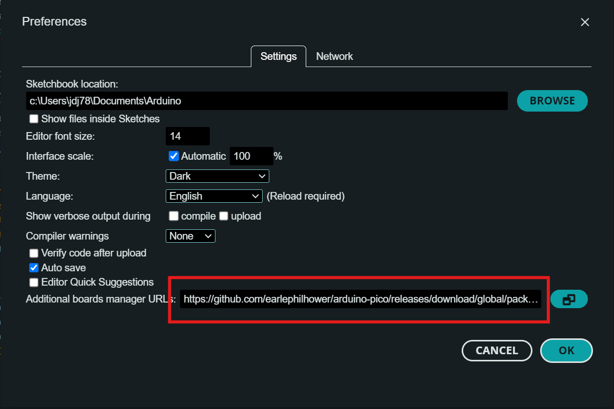
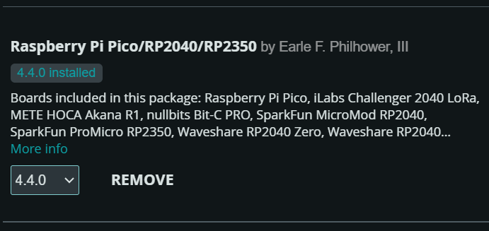
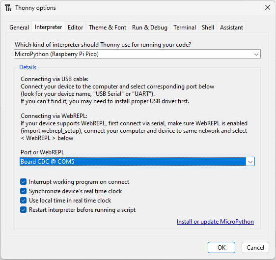

# Comparing Programming Paradigms on the Raspberry Pi Pico

## Objective

In this lab, students will explore the performance differences between C++ and MicroPython and between single-threaded and multi-threaded programing by implemening tests a Raspberry Pi Pico. The lab provides an opportunity to understand embedded systems programming and performance evaluation using popular development environments: Arduino IDE (C++) and Thonny (MicroPython).

Learning outcomes:
- Introduce the Raspberry Pi Pico, its key features, and programming environments.
- Understand the performance differences between C++ and MicroPython on the Raspberry Pi Pico.
- Compare single-threaded and multi-threaded programming on the Raspberry Pi Pico.
- Develop test benches for comparing computational performance, I/O performance, and threading performance.

---

## Section 1: Introduction to the Raspberry Pi Pico

The Raspberry Pi Pico is a microcontroller board based on the RP2040 chip. Key features include:

- Dual-core ARM Cortex-M0+ processor running up to 133 MHz.
- 264KB SRAM and 2MB flash memory.
- Multiple I/O options: I2C, SPI, UART, PWM, and ADC.
- Supports programming in C++ and MicroPython.

The Pico is designed to offer flexibility and performance, making it an excellent platform for this lab's focus on performance comparison.

---

## Section 2: Setting Up Arduino IDE for the Raspberry Pi Pico

### **Step 1: Install Arduino IDE**

1. Download Arduino IDE from the [official website](https://www.arduino.cc/en/software).
2. Install the IDE by following the platform-specific instructions (Windows, macOS, or Linux).

### **Step 2: Install the Raspberry Pi Pico Core**

1. Open Arduino IDE and go to **File > Preferences**.
2. In the "Additional Boards Manager URLs" field, add the following URL:
   ```
   https://github.com/earlephilhower/arduino-pico/releases/download/global/package_rp2040_index.json
   ```
3. Click **OK** to save.



### **Step 3: Add Raspberry Pi Pico Support**

1. Go to **Tools > Board > Boards Manager**.
2. Search for "rp2040" or "Raspberry Pi Pico."
3. Install the "Raspberry Pi RP2040 Boards" package by Earle Philhower.



### **Step 4: Connect the Raspberry Pi Pico**

1. Connect the Pico to your computer using a micro-USB cable.
2. Hold the **BOOTSEL** button on the Pico and plug it in. This puts the Pico in USB mass storage mode.
3. The Pico will appear as a storage device on your computer.

### **Step 5: Select the Board and Port**

1. In Arduino IDE, go to **Tools > Board** and select "Raspberry Pi Pico."
2. Go to **Tools > Port** and choose the port corresponding to the connected Pico.

### **Step 6: Upload a Blink Example**

1. Open the **File > Examples > 01.Basics > Blink** sketch.
2. Modify the pin number in the code to `LED_BUILTIN` (the onboard LED of the Pico).
3. Click **Upload**. The Pico's onboard LED should blink, confirming successful programming.

---

## Section 3: Using Thonny to Flash MicroPython onto the Raspberry Pi Pico

### **Step 1: Install Thonny IDE**

1. Download Thonny from the [official website](https://thonny.org/).
2. Install Thonny by following the platform-specific instructions (Windows, macOS, or Linux).

### **Step 2: Flash MicroPython Using Thonny**

1. Connect the Pico to your computer using a micro-USB cable.
2. Open Thonny IDE.
3. Go to **Tools > Options > Interpreter**.
4. In the "Interpreter" dropdown menu, select "MicroPython (Raspberry Pi Pico)."
5. If MicroPython is not already installed on the Pico, Thonny will prompt you to install it. Follow the on-screen instructions to flash MicroPython directly onto the Pico.
6. Once the process is complete, Thonny will automatically connect to the Pico, ready for programming.



### **Step 3: Write and Run a Test Script**

1. In Thonny, write the following code to blink the onboard LED:
```{python select}
from machine import Pin
from time import sleep

led = Pin("LED", Pin.OUT)

while True:
    led.toggle()
    sleep(0.5)
```
2. Save the file as `main.py` on the Pico.
3. Click **Run**. The Pico's onboard LED should start blinking, confirming successful setup.

---

## Section 4: Performance Comparison Tasks

The goal of this section is to test the performance of C++ and micro python various types of computation and IO. We will develop test benches for integer and floating point computation, digital I/O, analog to digital conversion, and digital to analog conversion. 

Helpful Hints and Tips:
- Use the `millis()` function in Arduino to measure time.
- Use the `time.ticks_ms()` function in MicroPython to measure time.
- To ensure that a serial connection is established before tests are run, add `while(!Serial);` to the end of the setup block in Arduino.

### **Task 1: Integer Math Performance**

1. To understand the relationship between computation and execution time, we will test how long it takes to execute an integer computation N times, where N=1, 10, 100, 1,000, 10,000, 100,000, and 1000,000. 
2. Implement the following pseudocode in both C++ (Arduino IDE) and MicroPython (Thonny). Feel free to put any integer computation you want inside the inner loop, but ensure that floating point computations are executed. 
3. Example task pseudocode:
```
Loop through the 7 different values of N:
  Store the current time
  Loop from 1 to N:
    Declare first integer
    Declare second integer
    Perform some floating point computation such as:
    Declare third integer = first integer + second integer
  Print the elapsed time for the inner loop
```
4. Measure the execution time in both environments and record the results.
   - In Arduino IDE, use `millis()` to measure the time.
   - In MicroPython, use `time.ticks_ms()`.

### **Task 2: Floating Point Math Performance**

1. Write a program in both C++ and MicroPython to perform a series of floating-point math operations (e.g., addition, multiplication, and division).
2. Example task pseudocode:
```
Loop through the 7 different values of N:
  Store the current time
  Loop from 1 to N:
    Declare first float
    Declare second float
    Perform some integer computation such as:
    Declare third float = (first float * second float)/(first float + second float)
  Print the elapsed time for the inner loop
```
3. Measure the execution time in both environments and record the results.

### **Task 3: Digital Output Test**

1. Write a program that tests how quickly the Raspberry Pi Pico can enable and disable a hardware pin in both languages. 
2. Implement the following pseudo code in both Arduino C++ and Thonny MicroPython. The code should turn ON and OFF a digital pin as quickly as possible and count the number of times it can do so in a set period of time.  Test this for different increments of time spanning from 1-15 second in 1 second increments. 

```
Loop through different durations spanning from 1-15 seconds in 1 second increments
  Initialize a counter variable to 0.
  Set the start time to the current time.
  While the elapsed time is less than a given duration (e.g., 1 second):
    Turn the pin ON
    Turn the pin OFF
    Increment the counter variable.
  Print the value of the counter variable, representing how many toggles occurred in the given duration.
```

3. Measure the performance in both environments and compare the results.

### **Task 4: Analog to Digital Converter**

1. Write a program to test how many analog readings the Raspberry Pi Pico can perform in a set period of time in both Arduino C++ and MicroPython.
2. The onboard temperature sensor is connected to the ADC on pin 4. 
3. Implement the following pseudocode in both environments:
```
Loop through different durations spanning from 1-15 seconds in 1-second increments:
    Initialize a counter variable to 0.
    Set the start time to the current time.
    While the elapsed time is less than the given duration:
        Perform an analog read on the temperature sensor.
        Increment the counter variable.
    Print the value of the counter variable, representing how many readings occurred in the given duration.
```
4. Measure the performance in both environments and compare the results.

### **Task 5: LED PWM Test**

1. Write a program in both C++ and MicroPython to control the brightness of the onboard LED using PWM.
2. The brightness of the LED is determined by the PWM value of the pin. The PWM should be a integer from 0-255. The brightness of the LED should oscillate smoothly once per second. This can be achieved through the use of a sine or cosine function. 
3. Implement the following pseudocode in both environments:
```
Loop through a set duration (e.g., 10 seconds
  Initialize a counter
  While the time is less than the duration
    Calculate the brightness of the led
    Set the PWM duty cycle to the calculated value
    Increment the counter
  Print the number of times the PWM value was updated
```
4. Measure the performance in both environments and compare the results.

## MicroPython Threading on the Raspberry Pi Pico

Threading allows tasks to run concurrently by assigning them to different processor cores. On the Raspberry Pi Pico, this can leverage both ARM cores. In MicroPython, the "_thread" module offers functions to start threads and synchronize data access.

### Main Functions

- `start_new_thread(function, args)`: Spawns a new thread to run the specified function.  
- `allocate_lock()`: Creates a lock object for synchronizing access to shared data.  
- `lock.acquire()`: Acquires the lock, blocking if necessary.  
- `lock.release()`: Frees the lock so other threads can take it.

### Example Usage

```python
import _thread
import time

# Shared resource
counter = 0
lock = _thread.allocate_lock()

# Increment counter on Core 1
def increment_counter():
    global counter
    while True:
        with lock:  # Acquire the lock
            counter += 1
            print(f"Core 1: Counter = {counter}")
        time.sleep(1)  # Simulate work

# Monitor counter on Core 0
def monitor_counter():
    global counter
    while True:
        with lock:  # Acquire the lock
            print(f"Core 0: Counter = {counter}")
        time.sleep(2)  # Simulate work

# Start the task on Core 1
_thread.start_new_thread(increment_counter, ())

# Main thread continues on Core 0
monitor_counter()
```

This approach demonstrates simple concurrency on the Pico, with two threads performing separate actions. Use locks to avoid data races anytime you modify shared variables. In this example, neither thread can modify or read the `counter` variable without first locking it. 

Threading can be particularly helpful for a system with multiple tasks. For example, one thread could handle sensor readings while another manages user input. By running these tasks concurrently, the system can be more responsive and efficient. For now, we will test using threading to see if we can improve the performance of some simple computations. 

Unfortunately, multithreading is not supported in the Arduino IDE. We will use micro python to test the performance of threading on the Raspberry Pi Pico.

### **Task 6: Threading Performance Test**

1. Write a program in MicroPython that sums all the numbers between 1 to 1000000 in a single thread. Test how long it takes the Pico to complete this task. Use the following pseudocode as reference:
```
Function calculate_sum(start, end):
    Initialize total to 0
    For i from start to end:
        Add i to total
    Return total

Start time measurement
Call calculate_sum(1, 1000000) and store the result
End time measurement

Print the result of the sum
Print the elapsed time
```

2. For reference, implement the same program in C++ using the Arduino IDE. Test how long it takes the Pico to complete this task and compre it to the equivalent MicroPython program. Use the same pseudocode as above.

3. Now implement the same program in MicroPython using threading. Create two threads, each summing half of the numbers between 1 and 1000000. Test how long it takes the Pico to complete this task and compare it to the single-threaded MicroPython and C++ programs.

4. Use the following pseudocode to implement the threading test:

```
Shared Variables:
    partial_sum1 = 0
    partial_sum2 = 0
    lock = Create a lock for synchronization

Function calculate_partial_sum_core1(start, end):
    Initialize local_sum to 0
    For i from start to end:
        Add i to local_sum
    Acquire lock
    Update partial_sum2 with local_sum
    Release lock

Function calculate_sum_core0(start, end):
    Initialize local_sum to 0
    For i from start to end:
        Add i to local_sum
    Update partial_sum1 with local_sum

Start time measurement
Start a new thread for calculate_partial_sum_core1(500001, 1000000)
Call calculate_sum_core0(1, 500000)

Wait until partial_sum2 is non-zero
Combine partial_sum1 and partial_sum2 to get total_sum
End time measurement

Print the result of the sum
Print the elapsed time
```

4. Measure the performance of the single-threaded and multithreaded programs in MicroPython and compare them to the C++ program. Compare the multithreaded performance to the single-threaded performance in both languages.

### **Task 7: Extra Credit (1-3 points) (Optional)**

Implement an agorithm that computes the sum of all the prime numbers between two values. The algorithm must meet the following requirements:
  - The algorithm must be implemented in MicroPython.
  - The algorithm must take in two values, `start` and `end`, and compute the sum of all prime numbers between `start` and `end`.
  - The algorithm must work for any range of values.

Conisder using some of the following techniques:
  - Use the Sieve of Eratosthenes algorithm to generate a list of prime numbers.
```python
def sieve_of_eratosthenes(limit):
    """Find all prime numbers up to 'limit' using the Sieve of Eratosthenes."""
    # Create a list to mark prime numbers
    sieve = [True] * (limit + 1)
    sieve[0] = sieve[1] = False  # 0 and 1 are not primes

    # Mark non-prime numbers
    for i in range(2, int(limit**0.5) + 1):
        if sieve[i]:
            for j in range(i * i, limit + 1, i):
                sieve[j] = False

    # Collect all primes
    primes = [x for x in range(limit + 1) if sieve[x]]
    return primes
```
  - Implement a function to check if a number is prime.
```python
def is_prime(n):
  """Check if a number is prime."""
  if n < 2:
      return False  # 0 and 1 are not prime numbers
  for i in range(2, int(n**0.5) + 1):  # Check divisors up to sqrt(n)
      if n % i == 0:
          return False  # Not prime if divisible by i
  return True  # Prime if no divisors found
```

  - Use threading to improve the performance of the algorithm.

Any solution to this problem will result in 1 extra credit point. However, additional points will be awarded to the top 3 solutions that are the most efficient and well implemented. The following criteria will be used to judge the solutions:
  - Execution time of the algorithm
  - Funcional range of the algorithm

### **Task 8: Visualize and Analyze Results**

1. For each section, use scatter plots, bar graphs and or tables to present the data, comparing execution times or counts across different tasks and environments (C++ Vs MicroPython, single-threaded vs multi-threaded, etc). These graphs/tables should illustrate the relevant differences between the two programming languages. If relevant and/or helpful, include trendlines as well as analysis of their significance. 
2. Write a summary of your findings, discussing the strengths and weaknesses of each programming paradigm based on the observed performance metrics. 
3. Suggest considerations for systems engineers considering what paradigm to use for their embedded systems project. This might include:
  - Potential optimizations to code
  - Use cases where one paradigm might be preferred over the other
  - Compare the data across tasks and languages to identify any consistent trends or anomalies that could inform future decisions about programming environments for embedded systems.
4. Give a comprehensive analysis as to why there are speed differences in the in execution time of the code in different paradigms. Are the same computations occurring in both versions of the code? If so, how do you account for the difference in execution speed. Discuss this topic thoroughly. 


