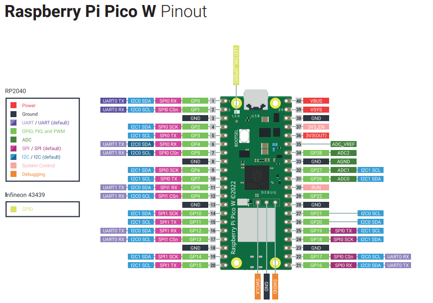
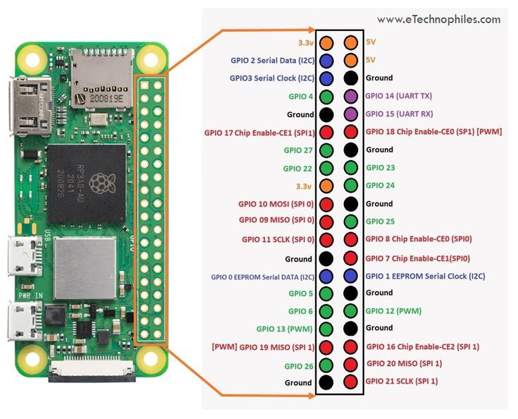

# Wired Communication Protocols

## Objective

In this lab, we will explore the basics of wired communication protocols. We will implement I2C to integrate a light-based proximity sensor and IMU with the Raspberry Pi Pico. We will also implement UART to establish a communication link between the Raspberry Pi Pico and a Raspberry Pi Zero, and test the real-world transmission speeds, and implement a simple data compression algorithm to reduce the amount of data transmitted.

## UART

Recall that UART (Universal Asynchronous Receive/Transmit) is a bidirectional communication protocol that uses two wires for communication. UART is a simple protocol that is widely used for communication between microcontrollers and other devices. UART is asynchronous, meaning that there is no clock signal shared between the devices. Instead, the devices must agree on a baud rate, which is the rate at which bits are transmitted.

In this lab, we will establish a UART connection between the Raspberry Pi Pico and a Raspberry Pi Zero and test the real world transmission speeds. 

### Setting up the Raspberry Pi Zero

The Raspberry Pi Zero 2 W is a small single-board computer that is similar to the Raspberry Pi Pico, but has more processing power and memory, and is capable of running a full operating system with a graphical user interface (GUI). Because the Zero is still significantly less powerful than a traditional laptop or desktop computer, running a full GUI can be slow and cumbersome. 

For this reason, we will use the Raspberry Pi Zero in headless mode, meaning that we will not connect a monitor, keyboard, or mouse to the Zero. Instead, we will connect to the Zero over SSH (Secure Shell) from a laptop or desktop computer or via a serial connection over USB (much like the REPL on the Raspberry Pi Pico).

The Raspberry Pi Zero has already been pre-configured to connect to the internet over WiFi. By default, it will connect to RedRover and a random IP address will be assigned. **Note:** The IP address of the Raspberry Pi Zero will usually remain constant for a few hours if you don't move between buildings. There are two ways to connect to the Raspberry Pi Zero: SSH and Serial.

The Raspberry Pi Zero has been pre-configured to allow a serial connection over USB. To connect to the Raspberry Pi Zero over serial, follow these instructions:

1. Install a serial terminal tool on your computer. For Windows, you can use [PuTTY](https://www.putty.org/). For Mac, you can use [CoolTerm](https://freeware.the-meiers.org/). For Linux, you can use [Screen](https://www.gnu.org/software/screen/manual/screen.html). However, the easiest, and most universal method is to use a the [Serial Terminal](https://marketplace.visualstudio.com/items?itemName=awsxxf.serialterminal) extension for Visual Studio Code.

2. Connect the Raspberry Pi Zero to your computer using a USB cable. The Zero should appear as a serial device on your computer. The Raspberry Pi Zero has two USB ports, one only for power and the other for data, labeled USB. Be sure to connect the USB cable to the data port. 

3. Open the serial terminal tool and connect to the Raspberry Pi Zero using a baud rate of 115200. The Raspberry Pi Zero will output a login prompt. The default username is `CPSPi` and the default password is `CPS`.

4. Once you are logged in, you can use the Raspberry Pi Zero as you would any other Linux computer. You can use the `ifconfig` command to find the IP address of the Raspberry Pi Zero. There are two IP addresses. 127.0.0.1 is the default internal IP address and the other is the external IP address. Take note of the external IP address so that we can connect to the Raspberry Pi Zero over SSH.

5. Run the command `sudo raspi-config` to bring up the Raspberry Pi configuration tool. Use the arrow keys and Enter key to navigate the menu. In order to use UART, we need to disable serial console. Follow these steps:

    - Run `sudo raspi-config`.
    - Navigate to Interfacing `Options → Serial`.
    - When asked *"Would you like a login shell to be accessible over serial?"*, select *No* (to prevent conflicts when we use UART).
    - When asked to enable the serial port hardware, select *Yes*.
    - Reboot the Pi Zero.

6. For a more detailed guide on setting up the Raspberry Pi Zero, refer to the [tutorial page](../../tutorials/zero_tutorial.md).

7. Before running any code or installing any packages via `pip` on the Raspberry Pi Zero, be sure to activate the virtual environment by running `pyenv activate cps` in the terminal.

### Wiring

Below is a pinout diagram of the Raspberry Pi Pico. Notice that it supports multiple UART interfaces. One of the challenges with this lab is that we do not have direct access to all of the pins on the Pico due to it being soldering directly to the XRP board. We will have to think of a creative way to access UART enabled pins. Look the [XRP board hardware overview page](https://docs.sparkfun.com/SparkFun_XRP_Controller/hardware_overview/). At the bottom you will see a Pinout Reference Table. Cross reference the pinout reference table with the pinout diagram of the Raspberry Pi Pico to determine which pins both support UART interface and are easily accessible with a jumper wire. (hint: consider the servos.)



Now consider the pinout diagram of the Raspberry Pi Zero. There is only one UART interface on the Zero. Consider which pins on on the Pico should connect to which pins on the Zero. Remember, the Pico and Zero must share a common ground for communication to work. While they might have the same ground through the shared USB bus, it is always a good idea to connect the grounds directly, especially when the robot starts driving untethered. 



**Remember:** `RX` stands for receive and `TX` stands for transmit. The `TX` pin on one device should connect to the `RX` pin on the other device, and vice versa.

### Code

Download the code for your [Raspberry Pi Pico](code/pico_uart.py) and [Raspberry Pi Zero](code/zero_uart.py). Also download the [helper class](code/message_types.py) to manage the message types. The code for the Pico is the master and the code for the Zero is the slave. The master is responsible for sending data over UART, while the slave is responsible for receiving and processing the data. This is an arbitrary distinction, and the roles could be reversed by implementing the appropriate code on each device. UART is full duplex, meaning that data can be sent and received simultaneously. So, in theory, both devices could simultaneously sending, receiving, and processing data. However, for the sake of simplicity, we will implement a simple two-way master-slave communication protocol.

Almost of all of the code for this portion of the lab utilizes asynchronous programming. This is because UART is a blocking protocol, meaning that the program will pause execution while waiting for data to arrive. This is inefficient for real-time applications, so we use asynchronous programming to allow the CPU to listen for incoming data while doing other tasks. Please review asynchronous programming in our [tutorial](../../tutorials/async_tutorial.md) if you are unfamiliar with the concept or need a refresher.

#### Step 1: Implement `send_data` function in `UARTMaster`

In this step, you will implement the `send_data` function in the `UARTMaster` class. This function sends data over UART and waits for an ACK response.

**Task:**
- Implement the function to send data over UART using the `MessageType.DATA` to indicate the message type. This is a string (`DATA`), and should be followed by a colon (`:`) and the data characters. These should all be conncatenated together to form a single string. Refer to `pint()` in UARTMaster for an example how to format the message.
- Use a try-except block to handle timeouts. You can set timeouts using `asyncio.wait_for()`.
- Refer to the `handshake` function for an example of how to handle timeouts.

#### Step 2: Handle `DATA` messages in `UARTSlave`

In this step, you will handle `DATA` messages in the `UARTSlave` class. This class is responsible for receiving and processing messages from the UART interface.

**Task:**
- Implement the case to handle `DATA` messages in the `handle_messages` function of `UARTSlave`.
- When a `DATA` message is received, send an ACK response back to the sender.
- You should strip off the `DATA:` prefix before processing the data.
- Print off the length of the data contained in the message to confirm proper transmission.

#### Step 3: Implement `simple_rle_compress` function in `UARTMaster`

In this step, you will implement the `simple_rle_compress` function in the `UARTMaster` class. This function compresses a string using a simple run-length encoding (RLE) algorithm.

RLE stands for Run-Length Encoding, which is a simple compression algorithm that replaces consecutive characters with the character followed by the number of occurrences. For example, the string 'aaabbc' can be compressed to '3a2b1c'.

**Task:**
- Implement the RLE compression algorithm to replace consecutive characters with the character followed by the number of occurrences.

#### Step 4: Implement `decompress` function in `UARTSlave`

In this step, you will implement the `decompress` function in the `UARTSlave` class. This function decompresses a string that was compressed using the RLE algorithm.

This function should take a compressed string as input and return the original string by undoing the RLE compression.

**Task:**
- Implement the RLE decompression algorithm to restore the original string from the compressed format.
- For example, '3a2b1c' should become 'aaabbc'.

#### Step 5: Implement `send_compressed_data` function in `UARTMaster`

In this step, you will implement the `send_compressed_data` function in the `UARTMaster` class. This function compresses data using RLE, sends it over UART, and waits for an ACK response.

**Task:**
- Compress the data using the `simple_rle_compress` function.
- Send the compressed data over UART and wait for an ACK response.

#### Step 6: Handle compressed data messages in `UARTSlave`

In this step, you will handle compressed data messages in the `UARTSlave` class.

**Task:**
- Implement the case to handle compressed data messages in the `handle_messages` function of `UARTSlave`.
- When a compressed data message is received, decompress the data using the `decompress` function and send an ACK response back to the sender.

#### Step 7: Implement `encrypt_decrypt` function in `UARTMaster`

In this step, you will implement the `encrypt_decrypt` function in the `UARTMaster` class. This function encrypts or decrypts data using a simple XOR cipher.

A XOR cipher is a simple encryption algorithm that works by performing the XOR operation between each character in the plaintext and a key. To decrypt the ciphertext, the same key is used to perform the XOR operation on the ciphertext. This is because the XOR operation is its own inverse, meaning that applying the XOR operation twice with the same key will return the original plaintext.

The basic structure of the XOR cipher is as follows:
- For each character in the plaintext,
- Convert to an integer using the `ord()` function,
- Perform the XOR operation with the key using the `^` operator,
- Convert back to a character using the `chr()` function.
- Contatenate the characters together to form the ciphertext.

**Task:**
- Implement the XOR cipher encryption/decryption algorithm.

#### Step 8: Implement `encrypt_decrypt` function in `UARTSlave`

In this step, you will implement the `encrypt_decrypt` function in the `UARTSlave` class. This function decrypts data that was encrypted using the XOR cipher.

**Task:**
- Implement the XOR cipher decryption algorithm.
- Use the same approach as in the `UARTMaster` class to perform the XOR operation.

#### Step 9: Implement `send_compressed_encrypted_data` function in `UARTMaster`

In this step, you will implement the `send_compressed_encrypted_data` function in the `UARTMaster` class. This function compresses and encrypts data, sends it over UART, and waits for an ACK response.

**Task:**
- Compress the data using the `simple_rle_compress` function.
- Encrypt the compressed data using the `encrypt_decrypt` function.
- Send the compressed and encrypted data over UART and wait for an `ACK` response.
- Ensure that `ACK` returns the expected length.

#### Step 10: Handle compressed and encrypted data messages in `UARTSlave`

In this step, you will handle compressed and encrypted data messages in the `UARTSlave` class.

**Task:**
- Implement the case to handle compressed and encrypted data messages in the `handle_messages` function of `UARTSlave`.
- When a compressed and encrypted data message is received, decrypt the data using the `encrypt_decrypt` function and decompress it using the `decompress` function.
- Print off the length of the data contained in the message to confirm proper transmission.
- Send an `ACK` response back to the sender.
- Be sure to send the `ACK` response with the length of the data contained in the message.

> Note: When analyzing how this protocol fits into the OSI model, keep in mind that UART is often considered a physical/datalink layer. Our custom packet-based protocol and message handling build on top of it.

### Testing

To test the UART communication between the Raspberry Pi Pico and the Raspberry Pi Zero, implement a function (or multiple functions) that sends a large amount of data from the Pico to the Zero and measures the time it takes to transmit the data.

This function should start by opening [this](code/data.txt) file and saving its contents as a string. Then, the function should send the data using the `send_data`, `send_compressed_data`, and `send_compressed_encrypted_data` functions. The function should measure the time it takes to transmit the data, including decompression and decryption time on the Zero. This is why it is essential that the zero send the `ACK` message after it has decompressed and/or decrypted the data.

Try this again with a different sized files. You can generate a data.txt file using the [generate_data.py](code/generate_data.py) script. This scrip will generate random numbers and characters to create a string that will be saved to a `data.txt` file. You can also vary how "random" the data is by changing the mean and standard deviation of the random number generator. A larger mean and smaller standard deviation will result in more repeating characters, which will compress better.

Reflect on how the data transmission speed changes with different data sizes and compression/encryption methods. What are the advantages and disadvantages of compressing and encrypting data before transmission? How does the data transmission speed compare to the theoretical maximum baud rate of the UART interface? What are some potential applications for the data compression and encryption methods you implemented in this lab? 

Graph some data to show trends in the data transmission speed as a function of data size and compression/encryption method. Include any other relevant data or analysis that you think would be helpful in explaining your results.

### Analysis

Consider the OSI model we learned about in class. For each of the 7 layers, analyze how the communication protocol we implemented in this lab fits into the model. See the [course notes](../../notes/Module5.md) and [powerpoint](../../pages/lectureslides/module3-5.pdf) for a refresher on the OSI model. Not all of the layers will be relevant to this lab, but consider the ones that are.

For reference, UART is a datalink layer protocol, however, the protocol we implemented in this lab is a higher level protocol that uses UART as a foundational layer. Consider how the different layers of the ISO model build on top of each other to create a complete communication system.

Brainstorm some potential applications for the communication protocol we implemented in this lab. What are some real-world scenarios where this protocol could be useful? What are some potential limitations or drawbacks of the protocol? How could the protocol be improved or extended to support additional features or functionality? What layers of the OSI model would be involved in these improvements?

Discuss the trade-offs between speed, reliability, and complexity/overhead in the communication protocol we implemented. How do these trade-offs affect the performance and usability of the protocol? What are some potential ways to optimize the protocol for different use cases or scenarios? How much overhead does adding features such as compression and encryption add to the communication speed? How does this change with file size or the randomness of the data? Include any graphs, diagrams, or pseudocode that you think would be helpful in explaining your analysis.

- Consider adding any notes on simplifying or grouping multiple questions if they seem repetitive.

## I2C

### Inertial Measurement Unit (IMU)

The IMU built into the XRP control board is the LSM6DSO. This IMU has a 3-axis accelerometer and a 3-axis gyroscope. The IMU is connected to the I2C bus on the XRP control board. Forunately, there exists significant software support for the XRP, so we don't have to implement the I2C communication for the IMU from scratch.

For reference, a gyroscope is microelectromechanical system (MEMS) that measures angular velocity. An accelerometer is a MEMS that measures acceleration. The gyroscope measures angular velocity in degrees per second, while the accelerometer measures acceleration in g's. Together, the gyroscope and accelerometer can be used to determine the orientation of the IMU in 3D space. Gyroscopes and accelerometers will be discussed further in the "Sensors" lab. 

For now, you should notice that the gyroscope will return values very close to zero when the IMU is stationary, because the XRP control board is not rotating. The accelerometer, on the other hand, should return values close to 1g in the z-direction (up and down) and 0 in the x and y directions. This is due to the gravitational force acting on the IMU. The accelerometer will only read 0 in all directions when the IMU is in free fall.

#### Scan for I2C Devices

Below is some code to open a generic I2C bus and scan for devices. This code will be useful for determining the I2C address of the IMU. 

```python
from machine import Pin, I2C
import time

# Define I2C pins (use default I2C1 on Pico W: GP6=SCL, GP7=SDA)
i2c = I2C(1, scl=Pin(19), sda=Pin(18), freq=400000)  # 400kHz frequency

def scan_i2c():
    print("Scanning for I2C devices...")
    devices = i2c.scan()
    
    if devices:
        print("Found devices at addresses:")
        for device in devices:
            print(hex(device))  # Print address in hexadecimal
    else:
        print("No I2C devices found.")

while True:
    scan_i2c()
    time.sleep(5)  # Wait 5 seconds before scanning again
```

What is the I2C address of the IMU?

Now download [this](code/imu.py) file as well as [this](code/imu_defs.py) helper file and run it on the XRP control board. This code will wraps around the I2C library to provide a more user-friendly interface for the IMU.

A new IMU object can be created using the following code:

```python
from imu import IMU
myIMU = IMU.get_default_imu()
```

### Tasks

Write a script that reads accelerometer data from the IMU and prints it to the console. The IMU class has a method called `get_accel_rates()` that returns a tuple of the x, y, and z acceleration values. Put this in a loop and analyze what frequency the data is being read at. Are values being repeated, or is each value unique? 

Do the same for the gyroscope data. The IMU class has a method called `get_gyro_rates()` that returns a tuple of the x, y, and z angular velocity values. Perform a similar analysis on the gyroscope data.

Now sending a command to the IMU to range the rate at which it measures new data. This can be done with the functions `acc_rate()` and `gyro_rate()`. The argument to these functions is the rate in Hz. Only certain rates are supported, so read the comments in the code to find an appropriate rate.

Try setting the rates to a value lower than the frequency your loop was reading data. What happens? Do you get repeat data, or does your loop slow down to match the rate of the IMU? Do this for both the accelerometer and gyroscope.

### Analysis 

Give careful consideration to the various tasks in this lab. Share your thoughts on various aspects of the I2C communication. What factors affect the data transfer rates of I2C? What are the advantages and disadvantages of using I2C for communication between devices? How does I2C compare to other communication protocols, such as UART and SPI? What layer of it the OSI model does I2C fit into?

Include any graphs, diagrams, or pseudocode that you think would be helpful in explaining your analysis.

## Conclusions

Compare I2C, UART, and our custom communication protocol built on top of UART. What are the advantages and disadvantages of each protocol? In what scenarios would you use each protocol? How do the protocols differ in terms of speed, reliability, complexity, and overhead? How do the protocols compare in terms of ease of use and implementation? What are some potential applications for each protocol?

- You may also combine some of the questions into a single comparative analysis if that feels more natural for explaining the trade-offs.

