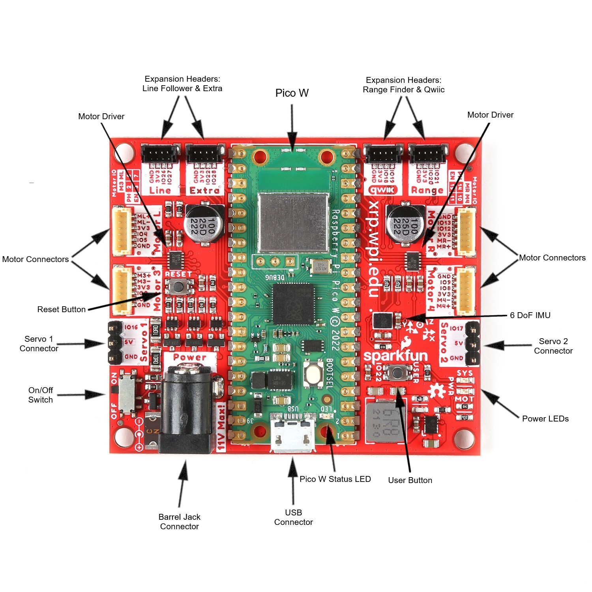

# Wired Communication Protocols

## Objective

In this lab, we will explore the basics of wired communication protocols. We will implment I2C to integrate a time-of-flight sensor and IMU with the Raspberry Pi Pico. We will also use Camera Serial Interface (CSI) to interface a camera module with the Raspberry Pi Zero. 

## UART

Recall that UART (Universal Asynchronous Receive/Transmit) is a bidirectional communication protocol that uses two wires for communication. UART is a simple protocol that is widely used for communication between microcontrollers and other devices. UART is asynchronous, meaning that there is no clock signal shared between the devices. Instead, the devices must agree on a baud rate, which is the rate at which bits are transmitted.

In this lab, we will establish a UART connection between the Raspberry Pi Pico and a Raspberry Pi Zero and test the real world transmission speeds. 

### Setting up the Raspberry Pi Zero

The Raspberry Pi Zero 2 W is a small single-board computer that is similar to the Raspberry Pi Pico, but has more processing power and memory, and is capable of running a full operating system with a graphical user interface (GUI). Because the Zero is still significantly less powerful than a traditional laptop or desktop computer, running a full GUI can be slow and cumbersome. 

For this reason, we will use the Raspberry Pi Zero in headless mode, meaning that we will not connect a monitor, keyboard, or mouse to the Zero. Instead, we will connect to the Zero over SSH (Secure Shell) from a laptop or desktop computer or via a serial connection over USB (much like the REPL on the Raspberry Pi Pico).

To set up the Raspberry Pi, follow these instructions:

1. First download and install the [Raspberry Pi Imager](https://www.raspberrypi.com/software/). 

2. Then download **_THIS_** Raspberry Pi Zero Image. 

2. Select the RASPBERRY PI ZERO 2 W from the list of available Raspberry Pi Devices.

3. Scroll to the bottom and select Use Custom, for the the Operating System selection. Select the provided image file.

4. Under Storage, select the SD card you wish to use and begin the imaging process.

5. Once the image is complete, remove the SD card from your computer and insert it into the Raspberry Pi Zero.

6. 

### Code

We will implement a simple test that transmits 10,000 bytes from the Raspberry Pi Pico to the Raspberry Pi Zero and measures the time it takes to transmit the data. Feel free to implement this test in any way that you think accurately measure the data transfer rate. Feel free to use the following pseudocode as a starting point if you want:

For the Raspberry Pi Pico:
```
1. Define BUFFER_SIZE = 10000
2. Create TEST_DATA = "A" repeated BUFFER_SIZE times

3. Initialize UART0 at 9600 baud on TX pin=0, RX pin=1

4. Pause for 2 seconds

5. Print "Pico (Sender): Starting test..."

6. Send the string "START TEST\n" over UART

7. Pause briefly (0.1 seconds)

8. Record current time as t_start
9. Write TEST_DATA (10,000 bytes) to UART
10. Record current time as t_end

11. Calculate delta_ms = (t_end - t_start)
    If delta_ms == 0, set delta_ms = 1  (avoid division by zero)

12. Calculate pico_bps = (BUFFER_SIZE * 8,000) / delta_ms
    (Explanation: 8 bits per byte times 1,000 ms → convert to seconds)

13. Print "Sent X bytes in Y ms -> Z bits/s" (pico_bps)

14. Initialize an empty response string
15. Set timeout_ms = 3000
16. Record start_wait = current time (ms)

17. While (current time - start_wait) < timeout_ms:
       If there is data in UART’s buffer:
           Read available bytes
           Append to response
       If response contains a newline, break out of the loop

18. If response is not empty:
       Print "Received from Zero: <response>"
   Else:
       Print "No response from Zero."

19. End
```

For the Raspberry Pi Zero:
```
1. Define BUFFER_SIZE = 10000
2. Set baud_rate = 9600

3. Open UART device '/dev/serial0' at baud_rate = 9600, timeout=1

4. Print "Zero (Receiver): Waiting for START TEST..."

5. Loop indefinitely:
    - If there's incoming data on UART:
        - Read one line (until newline)
        - If the line is "START TEST":
            - Print "'START TEST' received."
            - Break out of this loop

6. Record t_start = current time (seconds)

7. Set received_bytes = 0

8. While received_bytes < BUFFER_SIZE:
    - Read up to (BUFFER_SIZE - received_bytes) bytes from UART
    - If any bytes were read, increase received_bytes accordingly

9. Record t_end = current time (seconds)
10. Calculate delta_s = (t_end - t_start)
    If delta_s == 0, set delta_s = very small value (e.g., 0.000001)

11. Calculate zero_bps = (received_bytes * 8) / delta_s

12. Construct result_str:
    "Zero (Receiver): Received X bytes in Y s -> Z bits/s"

13. Print result_str

14. Write result_str back to the Pico over UART

15. End
```


### Setting up the Time-of-Flight Sensor

Recall that I2C uses two wires for communication: SDA (data line) and SCL (clock line). The Raspberry Pi Pico has 3 I2C buses, but we will use the default I2C bus (I2C0) for this lab. Becuase most sensors also require power, Sparkfun has created a Qwiic connector that combines power and I2C into a single connector with 4 pins. This header can be found on many of their sensors as well as the top side of the XRP control board. 

For more details about the connectors on the XRP control board, refer to the [XRP Hardware Overview Page](https://docs.sparkfun.com/SparkFun_XRP_Controller/hardware_overview/).

**_NOTE:_** The Qwiic connector has 4 small pins inside the connector. If the connector is plugged in at angle, the pins risk bending and breaking. Be sure to plug in the connector straight and carefully. 



### Inertial Measurement Unit (IMU)

The IMU built into the XRP control board is the LSM6DSO. This IMU has a 3-axis accelerometer and a 3-axis gyroscope. The IMU is connected to the I2C bus on the XRP control board. Forunately, there exists significant software support for the XRP, so we don't have to implement the I2C communication for the IMU from scratch. The standard software for the XRP can be [found here](https://github.com/Open-STEM/XRP_MicroPython/tree/main), under XRPLib. 

To use the IMU, we will need to import the IMU class from the XRPLib. 

```python
from XRPLib import IMU
myIMU = IMU()
```

Gyroscopes and accelerometers will be discussed further in the "Sensors" lab. For now its important to know that gyroscope measures angular velocity and the accelerometer measures acceleration. You should notice that the gyroscope will return values very close to zero when the IMU is stationary, because the XRP control board is not rotating. The accelerometer, on the other hand, should return values close to 1g in the z-direction (up and down) and 0 in the x and y directions. This is due to the gravitational force acting on the IMU. The accelerometer will only read 0 in all directions when the IMU is in free fall.


