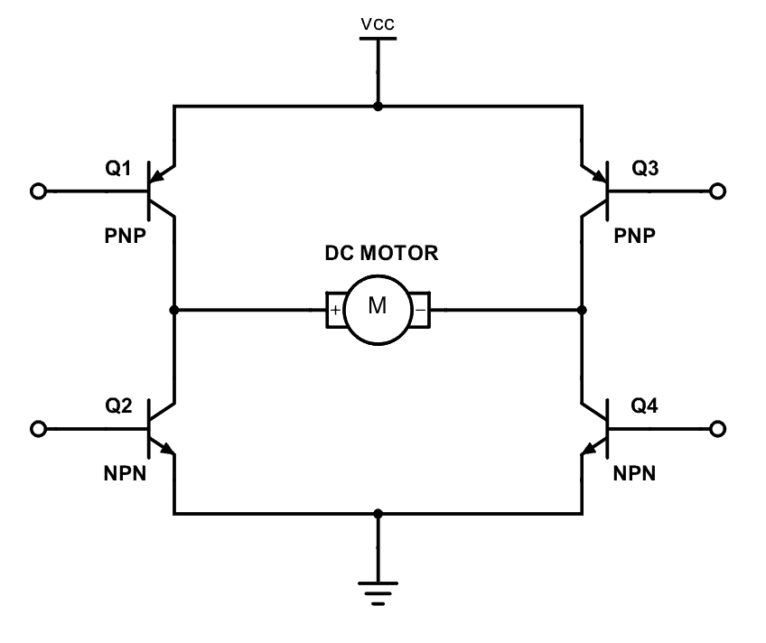

# DACs, Motors, and Encoders

## 1. PWM Overview

**Pulse Width Modulation (PWM)** is a technique commonly used to control the effective voltage delivered to a load (like a motor) by rapidly switching a digital output between HIGH (on) and LOW (off).

- The **duty cycle** is the proportion of time the signal is HIGH in one PWM period.

  - A higher duty cycle means more “on” time relative to “off” time, which increases the average voltage applied to the motor and thus increases its speed.
  - A lower duty cycle means less “on” time and a slower motor speed.

- The **PWM frequency** is how often these on/off cycles repeat per second. Most motor driver circuits can handle a broad range of PWM frequencies, but you typically choose a frequency high enough to avoid excessive audible noise or motor chatter, but not so high as to cause excessive switching losses.


- For details about to implement PWM in MicroPython on the Raspberry Pi Pico, read the [documentation](https://docs.micropython.org/en/latest/rp2/quickref.html#pwm-pulse-width-modulation). Below is simple example of how to implement PWM. 

```python
from machine import Pin, PWM

# Create a PWM object on GPIO pin 0 (you can choose any valid PWM pin)
motor_pin = Pin(14, Pin.OUT)

motor_pwm = PWM(motor_pin)

# Set the frequency (e.g., 20kHz)
# Note: the PWM pin will not work unless the frequency is set
pwm.freq(100)

# Set duty cycle (0-65535, where 65535 is 100%)
pwm.duty_u16(32767)  # 50% duty cycle
```

---

## 2. H-Bridge Fundamentals

An **H-bridge** is an electronic circuit that allows you to control the direction of a DC motor by reversing the polarity of the applied voltage. The DRV8835 is a dual H-bridge driver suitable for small brushed DC motors.

In an H-bridge driver:

- **Phase (or direction) pin**: Determines the polarity of the voltage across the motor terminals (i.e., whether the motor spins clockwise or counterclockwise).
- **Enable (or PWM) pin**: Controls whether the motor driver outputs are active (enabled). When you apply a PWM signal to the enable pin, you effectively turn the motor on and off quickly according to the duty cycle.

### Phase vs. Enable Pin

- **Phase pin**: Typically set to `HIGH` or `LOW` to indicate the direction in which the motor should spin. For example, `PHASE = HIGH` might mean clockwise, `PHASE = LOW` means counterclockwise.
- **Enable pin**: Receives the PWM signal. When the enable pin is driven with a PWM signal, the driver will turn on/off at the given duty cycle. A 100% duty cycle means fully on, and 0% means fully off.

### H-Bridge Mechanism

An H-bridge is composed of four switching elements (typically MOSFETs) arranged in an "H" configuration:

- **Basic structure**: Four MOSFETs (Q1, Q2, Q3, Q4) are arranged with the motor connected across the middle of the "H"
- **Direction control**:
    - **Forward operation**: Q1 and Q4 are turned ON while Q2 and Q3 remain OFF
        - This creates current flow from supply → Q1 → motor → Q4 → ground
    - **Reverse operation**: Q2 and Q3 are turned ON while Q1 and Q4 remain OFF
        - This creates current flow from supply → Q3 → motor (in opposite direction) → Q2 → ground
- **Braking**: 
    - **Active braking**: Either both high-side MOSFETs (Q1, Q3) or both low-side MOSFETs (Q2, Q4) are ON
        - This shorts the motor terminals, creating a resistive path for back-EMF
    - **Coast/Free-wheeling**: All MOSFETs are OFF, allowing the motor to spin freely
- **Prohibited state**: Q1+Q2 ON or Q3+Q4 ON would create a direct short circuit from power to ground



---

## 3. Overview of Callback Functions in MicroPython on the Raspberry Pi Pico

Callback functions (or interrupts) allow a microcontroller to respond to an external event in near real-time without continuously polling for that event. In the context of a Raspberry Pi Pico running MicroPython, you can configure a GPIO pin to trigger an interrupt when certain conditions are met—such as a rising edge, falling edge, or both edges of a digital signal.

### How Callback Functions Work
1. Event Trigger: A digital input changes state (e.g., an encoder pin transitions from LOW to HIGH).
2. Interrupt Service Routine (ISR): When this event is detected, the microcontroller automatically pauses normal program flow and executes a predefined function (the callback).
3. Return to Main Code: Once the interrupt is handled, the microcontroller returns to whatever it was doing previously.

This mechanism frees the main program from constantly monitoring GPIO changes. Instead, the main program can perform other tasks, knowing that it will 'jump' to the callback function whenever the specified event occurs.

### Basic Syntax in MicroPython
Here's a simplified example for attaching an interrupt in MicroPython on the Raspberry Pi Pico:

```python
from machine import Pin

# Set up the pin as an input with a pull-up resistor
button_pin = Pin(15, Pin.IN, Pin.PULL_UP)

# Define the callback function
def button_push_callback(pin):
    print('Someone pushed the button!!!')
    
# Attach the callback to the pin, triggered on rising edge
button_pin.irq(trigger=Pin.IRQ_FALLING, handler=button_push_callback)

# Main loop
while True:
    # Your main code runs here without needing to check the pin
    # The callback will handle interrupting this loop and running the callback
    # when the button is pushed
    time.sleep(1)  # Check the count every second
```

In the example:
- We configure `Pin(15)` as an input with an internal pull-up resistor.
- We define `button_push_callback` to print a message whenever the pin sees a falling edge.
- `button_pin.irq(...)` ties the interrupt trigger to our callback.

### Considerations
- Keep the code in your interrupt service routines short, as long routines can block other critical tasks.
- If you need to manage shared variables, declare them as `global` in the callback, or use other concurrency-safe mechanisms.
- Hardware debouncing or software filtering may be needed for mechanical switches.

---

## 4. Lab Tasks

Below are four tasks for students, taking advantage of the Raspberry Pi Pico, the DRV8835 motor driver, and the motor’s encoder.

### Task 1: Spin the Motor and Change Direction

1. **Objective**: Write code that:

   - Initializes a GPIO pin for PWM output to the “enable” pin of the motor driver.
   - Initializes a GPIO pin as a simple digital output to the “phase” pin of the motor driver.
   - Varies the PWM duty cycle to change speed.
   - Changes the phase pin to reverse direction.

2. **Guidance**:

   - Select a PWM pin on the Pico and set its frequency (start with 50Hz).
   - Set the duty cycle to 50% initially to observe moderate speed.
   - Toggle the phase pin to observe direction changes.

3. **Example Pseudocode**: this is a very high level example of how you can test your motors. Feel free to modify this code. The import part of this lab is being able to control the direction and speed of the motors.

   ```
   declare phase pin
   declare enable pin

   declare enable pwm object
   set pwm frequency

   set direction with phase pin
   set pwm duty cycle

   sleep to 5 seconds

   set other direction with phase pin
   set pwm duty cycle

   sleep for 5 seconds
   ```

### Task 2: Function to Accept Speed from -100 to 100

1. **Objective**: Write a function `set_motor_speed(int speed)` that takes a value in the range `[-100, 100]`. Negative values will make the motor spin in one direction, positive in the opposite, and the magnitude controls speed.

2. **Key Steps**:

   - Determine the direction based on the sign of `speed`.
     - If `speed < 0`, `PHASE_PIN = LOW`.
     - If `speed >= 0`, `PHASE_PIN = HIGH`.
   - Convert the magnitude of `speed` (ignoring the sign) to a valid duty cycle (e.g., 0–100%).
   - Set the PWM duty cycle accordingly.

3. **Possible Pseudocode**:

   ```
   function set_motor_speed(speed):
       Ensure speed is within -100 to 100

       if speed >= 0:
           direction_pin = HIGH
       else:
           direction_pin = LOW

       duty_cycle = absolute_value(convert_to_int(speed*65535/100))

       update phase pin based on sign of speed
       update duty cycle of pwm pin

   ```

### Task 3: Polling the Encoder in a While Loop

1. **Objective**: Continuously monitor the encoder output (one channel) and increment a counter each time the pin transitions from LOW to HIGH. Because we don't know when the encoder 

2. **Guidance**:

   - Configure a GPIO pin (e.g., `ENCODER_PIN`)` as input.
   - Use a simple while loop that continuously reads the current state of the pin.
   - Compare the current reading to the previous reading to detect a rising edge (i.e., from LOW to HIGH).
   - When a rising edge is detected, increment a counter variable.

3. **Sketch/Pseudocode**:

   ```
   ENCODER_PIN = new input pin

   encoder_count = 0
   previous_state = read ENCODER_PIN value

   while (true):
       current_state = gpio_read(ENCODER_PIN)
       if (previous_state == LOW and current_state == HIGH):
           encoder_count += 1
       previous_state = current_state

       // (Optional) Print or log encoder_count
   ```

### Task 4: Interrupt Callback for the Encoder

1. **Objective**: Instead of continuously polling, configure a callback (interrupt service routine) that fires on a rising edge of the encoder pin.

2. **Guidance**:

   - Configure `ENCODER_PIN` to trigger an interrupt on the rising edge.
   - Write the interrupt callback function to increment a global or static counter.
   - The callback can be configured by passing the function into the `irq` function in the `Pin` object that you created for your input pin. See the push button example 
   - The main loop can perform other tasks while the callback handles encoder events in the background.

3. **Sketch/Pseudocode**:

   ```
   encoder_count = 0

   // Callback function
   function encoder_rising_edge_callback():
       encoder_count += 1

   // Configuration callback using the irq function in the pin object 
   // attach_interrupt(ENCODER_PIN, RISING_EDGE, encoder_rising_edge_callback);

   while (true):
       // main loop can do other things
       // use encoder_count whenever needed
       delay(1000)
   ```

### Task 5: Measuring Relationship Between PWM and Speed

Here, you’ll combine PWM speed control with the encoder’s callback-based measurement to get a rough mapping between “PWM duty cycle” and “counts per second.”

1. **Objective**: For each PWM value (0 through 100 in steps of 10, or some similar step-size):

   - Reset the encoder counter to 0.
   - Run the motor at that PWM speed for 1 second.
   - Record how much the encoder count has increased in that second (i.e., pulses per second).
   - Repeat for 100 different speeds or your chosen step size.

2. **Nested For-Loop Structure**:

   - The **outer loop** goes through PWM values (0, 10, 20, …, 100).
   - The **inner loop** measures how many counts are accrued in one second at each PWM setting.

3. **High-Level Pseudocode**:

   ```
   for speed in range(100):
       set_motor_speed(speed)
       reset encoder_count to 0
       sleep(1) //sleep for one second to allow the motor to get up to speed

       start_time = current_time()
       while (current_time() - start_time < 1000 milliseconds):
           // Wait for 1 second (in real code, you might check if 1 second passed)
           // The encoder interrupt is incrementing encoder_count in the background

       // Now 1 second has elapsed
       counts = encoder_count
       print("PWM =", speed, "Counts in 1 second =", counts)
   ```

   - You can store each `counts` value in an array or simply print it out for further analysis.

---

## 4. Discussion Questions

- What are the advantages of using callback interrupts over the polling method for handling asynchronous events? 
- Give an example application where polling might be a better choice than using interrupts.
- Can you think of any drawbacks to using callback interrupts?
- Give an example application where interrupts might be a better choice than a polling method.
- Briefly discuss the applications of these concepts to CPS and broader system design. 
- What is the nature of the relationship between PWM values and motor speed? Is a linear fit a good assumption?
- What factors impact the relationship between the PWM value and motor speed? Are these factors constant, or do they change over time?