# Lab 7: Putting It All Together

## Overview
In this lab, you will integrate all the components and concepts you've learned throughout the course into a functioning robot system. You'll connect hardware components, implement the Roomba algorithm, utilize computer vision, establish communication between microcontrollers, and send data to your laptop.

## 1. Assembly

### 1.1 Range Sensor

- Start by inserting the range sensor into the range sensor holder.

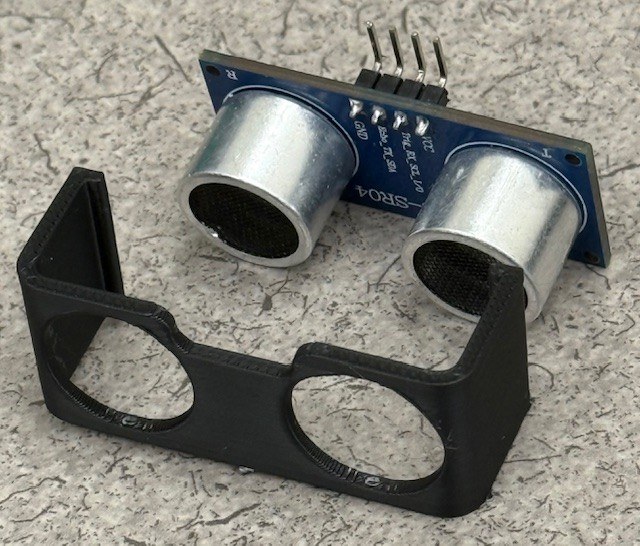
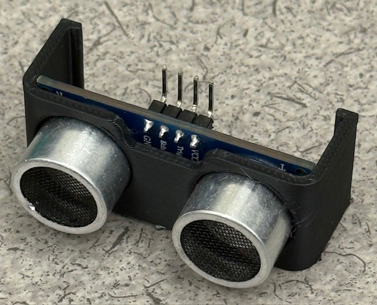

- Attach the range sensor holder to the range sensor mount.

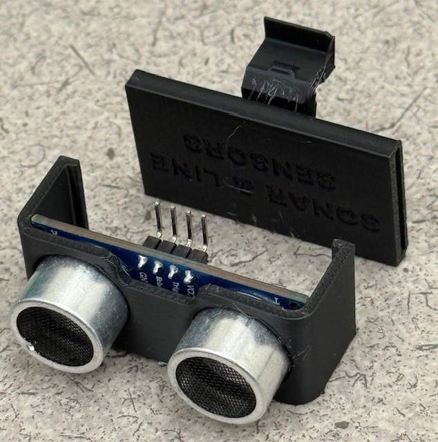

- Attach the range sensor mount to the XRP.

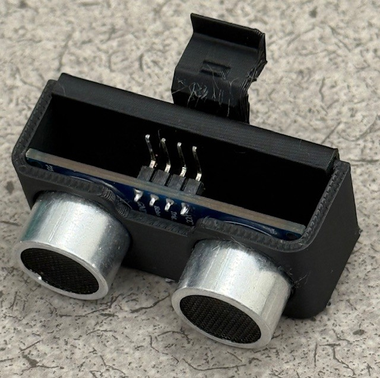

### 1.2 Proximity Sensor

- Because we are using the pin headers instead of the qwiic connector for the proximity sensor, we have to mount the proximity sensory in the holder at an "incorrect" orientation. 

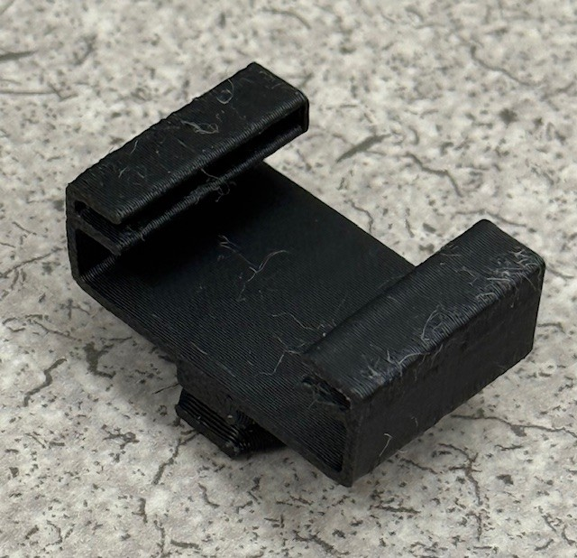

- The proximity sensor will only go into the holder half way. This is fine. 

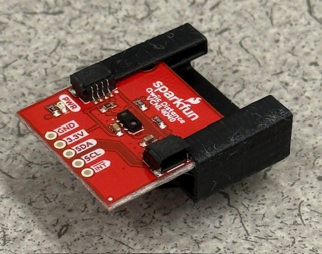

- The proximity sensor holder attaches into one of the hex points of the mount. 

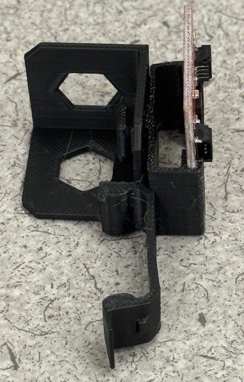
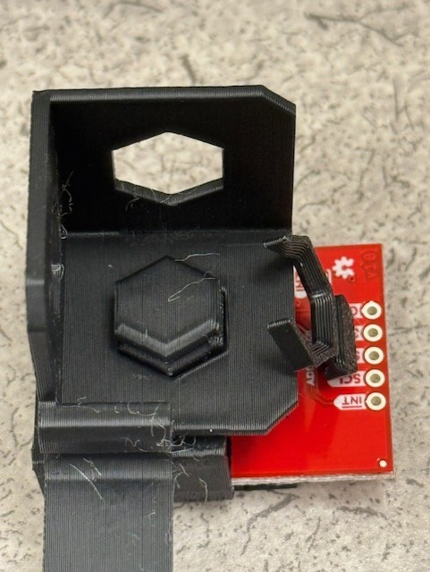

- The hex nut attaches to the proximity sensor holder and secures it to the mount.
  
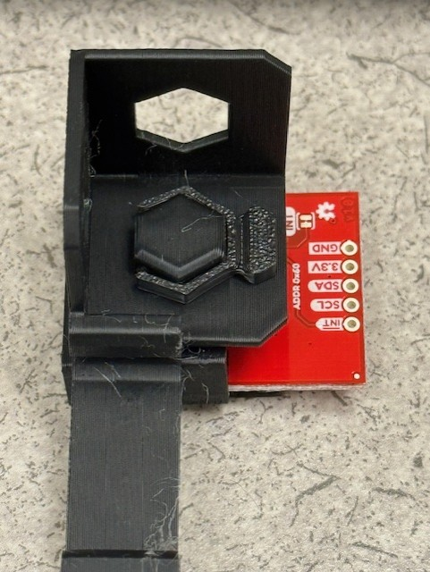

- The proximity sensor mount can be attached anywhere on the XRP.

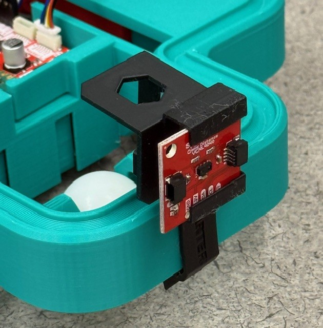

### 1.3 Raspberry Pi Pico

- Insert the Raspberry Pi Zero into its mount.

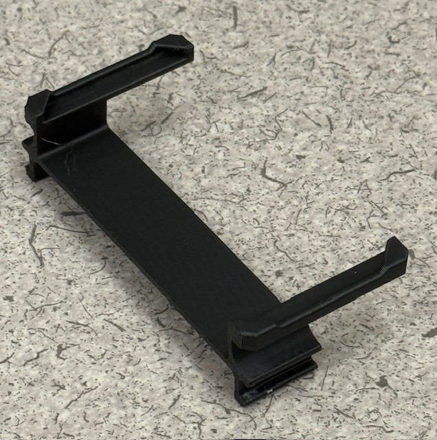
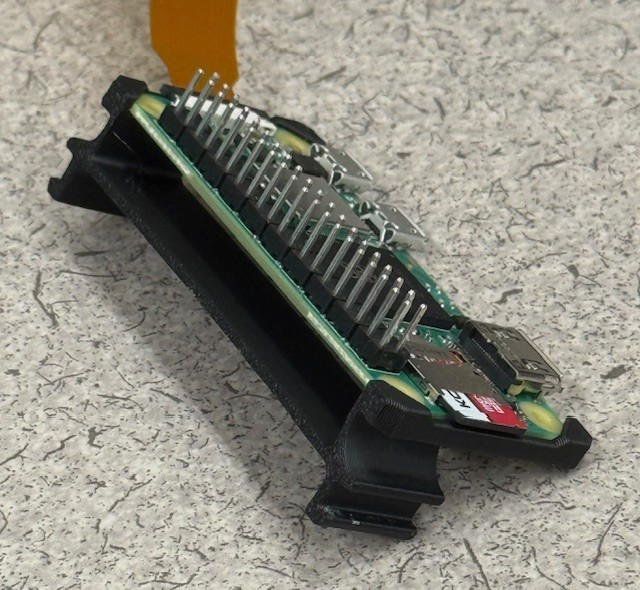

- Attach the Raspberry Pi Zero mount to the XRP and slide it forward to secure it.

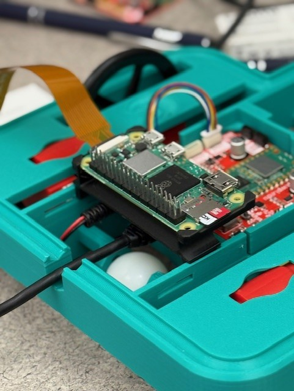
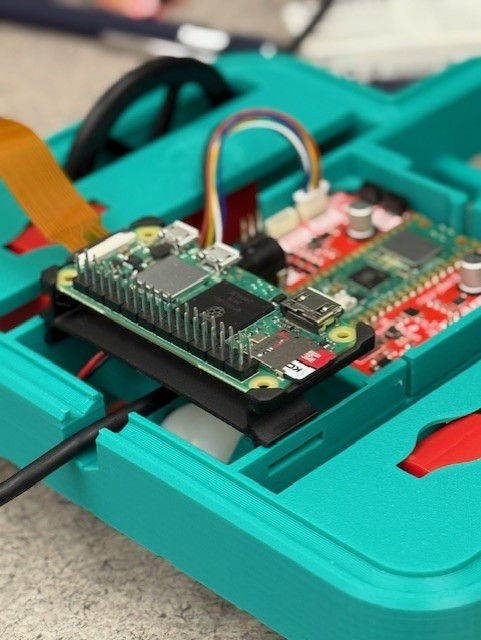

### 1.4 Servo & Camera

- The servo arm attaches to the end of the server as a fit press. 
- Insert the servo arm int the camera mount, ensuring that the side of the servo arm that attaches to the servo is facing away from the camera.
- It might seem like this isn't a perfect fit, that is fine. 
  
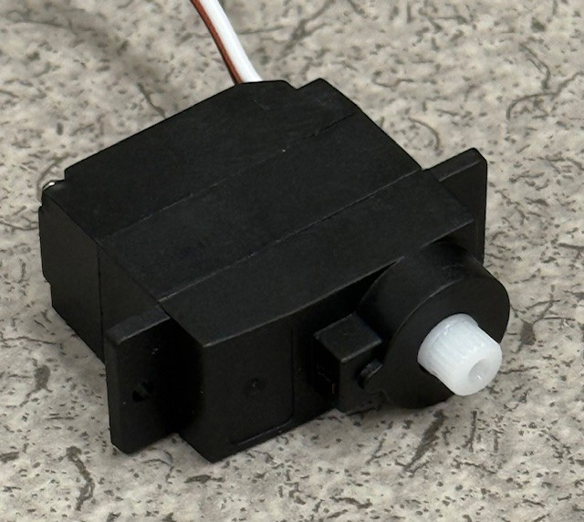
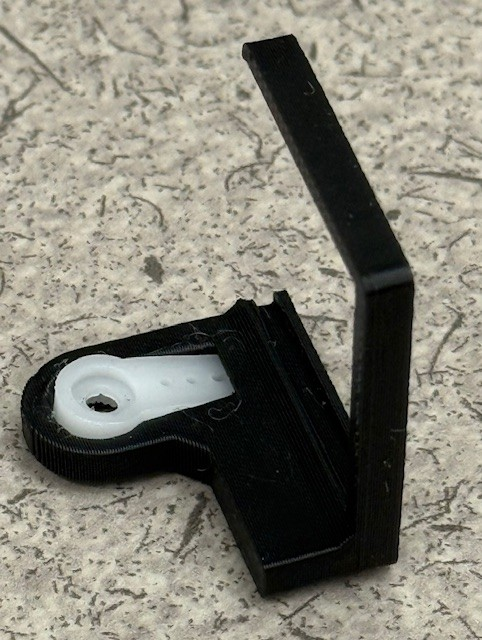

- Attach the servo arm/camera mount to the servo

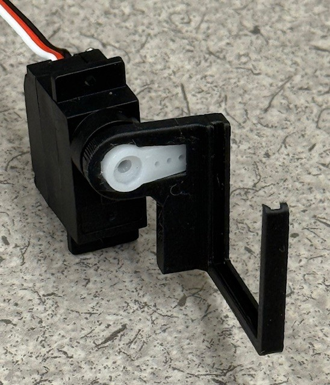

- Attach the servo holder to the servo mount (which is identical to the proximity sensor mount).

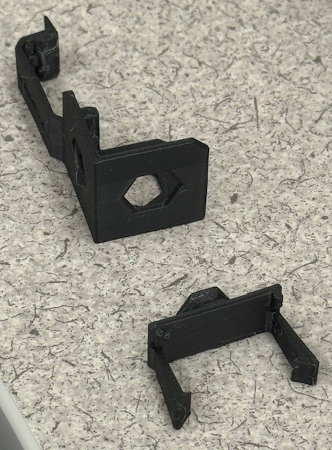

- Secure the servo holder to the servo mount using a hex bolt. 

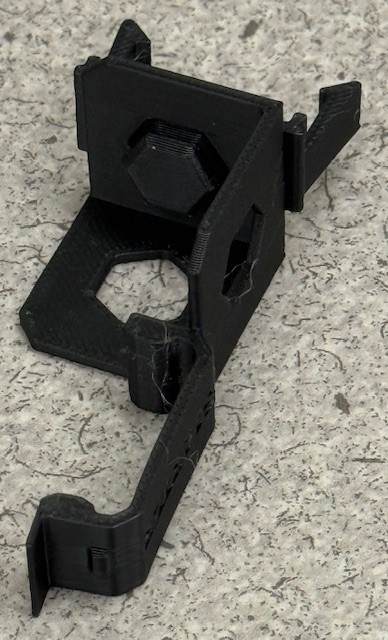
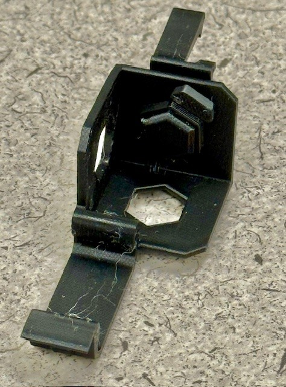

- Attach the servo mount to the XRP.
- Insert the servo into the servo mount and attach the camera.

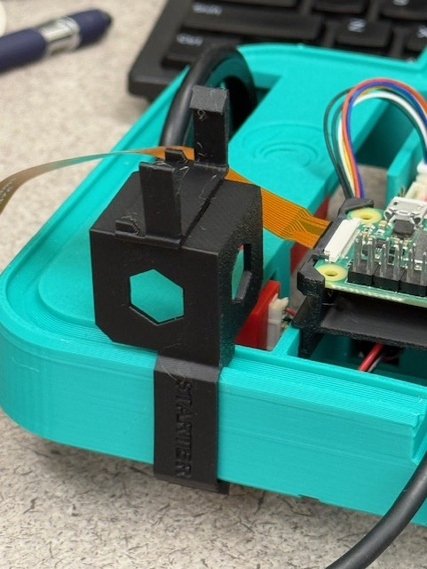
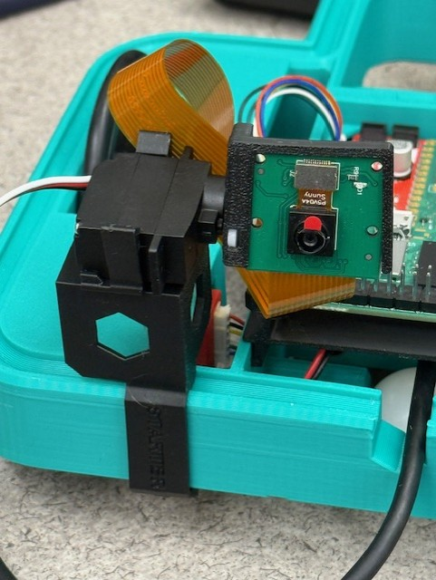

## 2. Implementing the Roomba Algorithm

In this section, you will implement a Roomba-like algorithm that enables your robot to navigate its environment autonomously.

### Overview of [`rumba.py`](code/pico/roomba.py)

The `RumbaRobot` class implements a simple but effective autonomous navigation algorithm inspired by Roomba vacuum cleaners. Here's how it works:

#### Key Components:
- **Sensors**: Uses a rangefinder (ultrasonic sensor) for forward obstacle detection and a VCNL4040 proximity sensor for rear obstacle detection
- **Movement Control**: Utilizes the differential drive system for precise movement control
- **State Machine**: Uses a state-based approach with three main states:
  1. `STATE_FORWARD`: Robot moves forward until detecting an obstacle
  2. `STATE_TURN`: Robot turns to avoid obstacles
  3. `STATE_BACK_UP`: Robot backs up when necessary

#### Algorithm Logic:
- While moving forward, continuously checks distance to obstacles
- When an obstacle is detected in front (distance < 20cm), enters turning state
- Randomly selects turn direction and duration for unpredictable navigation
- Uses proximity sensor to detect obstacles behind the robot
- Incorporates random behavior changes to prevent getting stuck in repetitive patterns

#### Implementation Requirements:
1. Ensure proper connection of rangefinder and proximity sensors
2. Set appropriate thresholds for obstacle detection
3. Tune the movement speeds based on your robot's characteristics
4. Test and adjust the random behavior parameters for effective exploration
5. **Make sure the code runs automatically on bootup**
    - This can be done by renaming the script `main.py` and uploading it to the pico
    - When the USB micro cable is disconnected and the XRP is powered via battery, `main.py` will run automatically on bootup

### Task:
1. Study the provided `rumba.py` implementation
2. Adjust constants like `SAFE_DISTANCE_CM` and `TURN_SPEED` to optimize performance
3. Run the algorithm on your robot and observe its behavior
4. Make necessary modifications to improve navigation in your specific environment, for example
    - Depending on what end of the robot is the "front", you might need to reverse the direction that the algorithm considers forward. This can be done using negative signs in front of the wheel speeds. 
    - You might find that the robot runs too fast or slow, try changing the speed of the robot. 

## 3. Computer Vision Implementation

In this section, you'll adapt the computer vision algorithm you developed in the previous lab to work with your robot.

Tasks include:
- Setting up the camera feed on the Raspberry Pi Zero
- Implementing the object detection algorithm
- Processing detection results to identify objects of interest
- Optimizing the algorithm for real-time performance

Your computer vision system should be able to detect and classify objects in the robot's environment.

## 4. UART Communication: Raspberry Pi Zero to Pico

In this section, you'll establish communication between the Raspberry Pi Zero (running computer vision) and the Raspberry Pi Pico (controlling the robot). For simplicity, you will only need to send message from the Zero to the Pico (no messages from the Pico to the Zero). 

### UART Callback function

In [Lab 1](../Lab1/Lab1.md), you implemented an entire asynchronous UART server/client architecture. We are going to simplify this down to a one-way UART channel using a callback function. 

Below are example scripts for the Pico and Raspberry Pi Zero that demonstrate this.

#### [`uart_example_pico.py`](code/pico/uart_example_pico.py) (Raspberry Pi Pico)

This MicroPython script runs on the Raspberry Pi Pico and is responsible for receiving messages via UART.

**Overview of Operation:**

1.  **Initialization**:
    *   Imports necessary modules (`UART`, `Pin` from `machine`, and `time`).
    *   Defines UART configuration parameters: `UART_ID` (e.g., 0), `BAUD_RATE` (e.g., 115200), and specific `TX_PIN` and `RX_PIN` for the UART communication.
    *   Initializes a `UART` object with these parameters.

2.  **Callback Function (`uart_rx_callback`)**:
    *   This function is designed to be executed automatically whenever new data arrives on the UART receive line and the line subsequently becomes idle.
    *   It takes one argument, `uart_obj`, which is the UART instance that triggered the interrupt.
    *   Inside the callback, it checks if there's any data available using `uart_obj.any()`.
    *   If data is present, it reads all available bytes using `uart_obj.read()`.
    *   It then attempts to decode the received bytes as a UTF-8 string and prints the message to the Pico's console.
    *   Includes basic error handling for `UnicodeError` (if data isn't valid UTF-8) and other exceptions.

3.  **Interrupt Configuration (`uart.irq`)**:
    *   The core of the non-polling message reception is `uart.irq(trigger=UART.IRQ_RXIDLE, handler=uart_rx_callback)`.
    *   `uart.irq()` configures an interrupt handler for the UART peripheral.
    *   `trigger=UART.IRQ_RXIDLE`: This specifies the condition for the interrupt. `IRQ_RXIDLE` triggers when the UART has received data, and the RX line has then been idle for a short period. This is generally preferred for message-based communication as it often indicates the end of a transmission, rather than `UART.IRQ_RXNEMPTY` which would trigger for every single byte received.
    *   `handler=uart_rx_callback`: This tells the Pico to execute the `uart_rx_callback` function when the `IRQ_RXIDLE` condition is met.

4.  **Main Loop**:
    *   The script prints initialization messages.
    *   An infinite `while True` loop with `time.sleep_ms(100)` keeps the script running. This allows the Pico to be responsive to interrupts, as interrupt handlers can preempt the main loop. The sleep also reduces CPU load.
    *   Includes `try...except KeyboardInterrupt...finally` for graceful shutdown and deinitialization of the UART.

#### [`uart_example_zero.py`](code/zero/uart_example_zero.py) (Raspberry Pi Zero)

This Python script runs on the Raspberry Pi Zero and is responsible for sending messages via UART to the Pico.

**Overview of Operation:**

1.  **Initialization**:
    *   Imports `serial` (from the `pyserial` library, which needs to be installed: `pip install pyserial`) and `time`.
    *   Defines `SERIAL_PORT` (e.g., `/dev/serial0` or `/dev/ttyS0` on a Raspberry Pi) and `BAUD_RATE` (which must match the Pico's configuration).

2.  **Serial Connection**:
    *   The `main()` function attempts to open a serial connection using `serial.Serial(SERIAL_PORT, BAUD_RATE, timeout=1)`.
    *   It includes extensive error messages and suggestions if the serial port cannot be opened, which is common on Raspberry Pi if the serial port is not configured correctly (e.g., used by the system console or Bluetooth).

3.  **Sending Messages**:
    *   If the port opens successfully, the script enters a loop.
    *   It prompts the user to `input("Message: ")`.
    *   If the user types "exit", the loop breaks.
    *   Otherwise, the entered message is encoded into bytes using `message.encode('utf-8')`. A newline character (`\n`) is appended to the message before encoding. This helps the receiving end (Pico) to potentially delimit messages if it were reading line by line, though the `IRQ_RXIDLE` on the Pico often handles message framing well.
    *   The encoded bytes are sent over the serial port using `ser.write()`.
    *   A small delay (`time.sleep(0.1)`) is added.

4.  **Cleanup**:
    *   A `try...except...finally` block ensures that if the serial port was opened, `ser.close()` is called to release the port when the script exits or is interrupted.

### Notes

1. **UART Wiring**
    - For setting up the UART wiring, reference your work in Lab 1. 
2. **Powering the Zero**
    - Run 5v and ground from the Pico to the Zero via one of the servo headers on the XRP control board.
3. **Duplex**
    - UART is full-duplex communication protocol. However, it doesn't need to be. 
    - Because messages only need to flow from Pico to the Zero (and not the other direction), you can remove the wire connecting the Pico TX to the Zero RX pins. 
    - Be sure to test that messages are still being passed from the Zero to the Pico via the remaining wire.
4. **Running Code on the Zero**
    - Use USB micro cable to create an initial connection to the Zero. 
    - Once you know the IP address of the Zero, you can log in vis SSH from your laptop: `ssh CPSPi@<ZERO IP ADDRESS>`, for example: `ssh CPSPi@10.49.12.225`.

### Tasks

Modify the `roomba.py` script to blink the onboard led whenever the Zero detects one of the objects from the computer vision task.

1. Add a UART connection to your `roomba.py` script and to your Zero computer vision script.
2. Create a UART callback function on the Pico that blinks the led when it gets a message from the zero. 
3. Record a video demonstrating that this function works as expected

## 5. Servo (Optional 2 points extra credit)

As your robot navigates around the room, it can tilt the camera up and down using the servo. 

For example code using the servo, use [`servo.py`](code/pico/servo.py). 

Record a video of this process working along side the rest of the `roomba.py` code for 2 extra credit points. 

## 6. UDP Communication: Pico to Laptop (Optional 2 points extra credit)

Implement UDP communication to send detection results from the Pico to your laptop.

Tasks include:
- Configuring the Pico for network communication
- Implementing a UDP client on the Pico
- Creating a message format for detection information
- Setting up a UDP server on your laptop to receive messages

When the Pico receives information about a detected object from the Raspberry Pi Zero, it should forward this information to your laptop via UDP. Your laptop should display what object the robot has found (as text in the terminal).

Record a video of this feature working to get 2 extra credit points!

## Submission Requirements

To successfully complete this lab, you must:

1.  **Complete all assigned tasks:**
    - Assemble the robot with all specified components.
    - Implement and test the Roomba algorithm on the Pico.
    - Implement and test the computer vision algorithm on the Raspberry Pi Zero.
    - Establish and test UART communication between the Raspberry Pi Zero and the Pico.
    - Establish and test UDP communication between the Pico and your laptop.
2.  **Record a video demonstration:**
    - The video should clearly show your robot operating autonomously, detecting objects, and sending information to your laptop.
    - The easiest way to do this is to upload a video to youtube and include a link in your lab report.
3.  **Submit a short reflection:**
    - Write a brief reflection discussing the main components of this lab. Include your thoughts and learnings on:
        - Wired communication protocols (e.g., UART)
        - Wireless communication protocols (e.g., UDP over Wi-Fi)
        - Embedded systems computing (e.g., Raspberry Pi Pico)
        - Single board computer system computing (e.g., Raspberry Pi Zero)
        - Actuators (e.g., motors, servo)
    - Consider why we partitioned the functionality of the system the way we did
        - What type of computation is the Pico responsible for (and why)?
        - What type of computation is the Zero responsible for (and why)?
        - What type of computation is the cloud responsible for (and why)?
